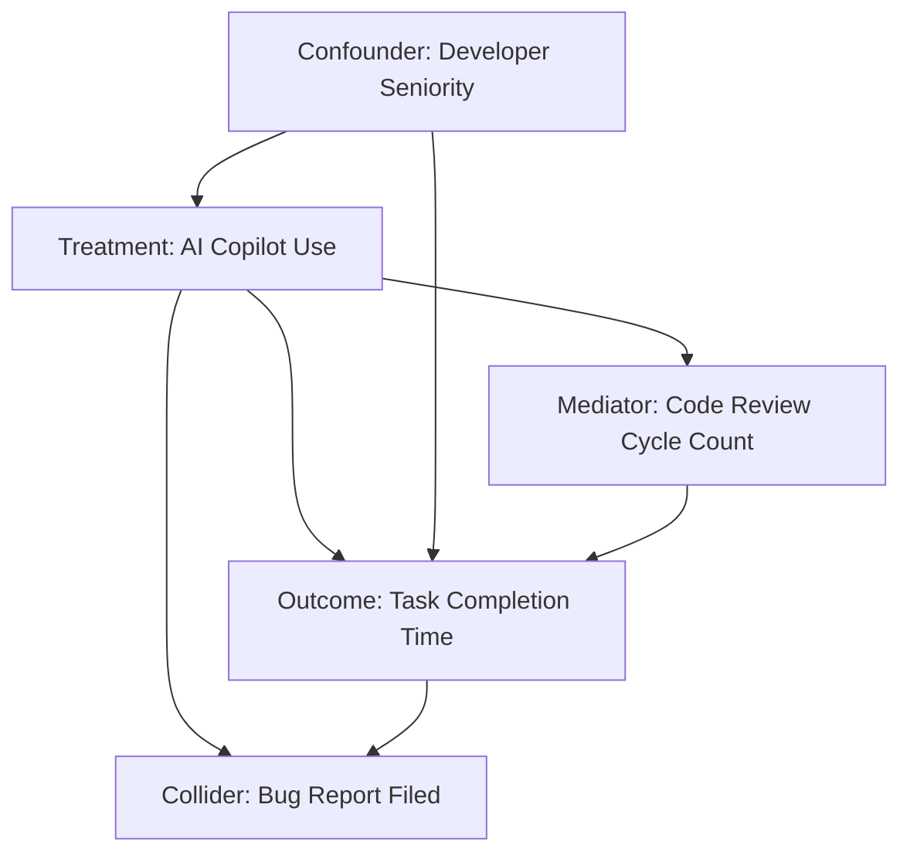

# Causal Inference & Directed Acyclic Graph (DAG) Evaluator

## Purpose
Examine observational research designs, structural equation models, and empirical data analysis proposals using causal inference frameworks (Pearl's Causal DAGs and Rubin's Potential Outcomes framework) to identify confounding, eliminate selection bias, avoid collider conditioning, and determine valid backdoor adjustment sets for causal effect identification.

## Inputs
- `CAUSAL_HYPOTHESIS`: Proposed treatment variable ($X$), target outcome variable ($Y$), and suspected covariates ($Z_1, Z_2, \dots, Z_n$).
- `OBSERVATIONAL_CONTEXT`: Domain background, data collection environment, selection filters, and unobserved latent variables.
- `PROPOSED_ESTIMATION_MODEL`: Proposed regression equation, propensity score specification, or matching strategy.

## Instructions
1. **Construct Formal Directed Acyclic Graph (DAG)**: Map variable relationships into a directed acyclic graph where directed arrows ($A \rightarrow B$) represent direct causal mechanisms. Include latent/unobserved variables ($U$).
2. **Classify Covariate Roles**:
   - **Confounders ($C$)**: Common causes of both treatment $X$ and outcome $Y$ ($X \leftarrow C \rightarrow Y$). MUST be controlled/adjusted for to block spurious backdoor paths.
   - **Mediators ($M$)**: Variables on the causal pathway between treatment $X$ and outcome $Y$ ($X \rightarrow M \rightarrow Y$). MUST NOT be controlled for if estimating total causal effect.
   - **Colliders ($K$)**: Variables jointly caused by two other variables ($X \rightarrow K \leftarrow Y$). MUST NOT be conditioned on, as controlling for a collider opens a spurious non-causal path (selection bias / Berkson's paradox).
   - **Instrumental Variables ($I$)**: Variables affecting treatment $X$ directly but affecting outcome $Y$ ONLY through $X$ ($I \rightarrow X \rightarrow Y$).
3. **Apply Pearl's Backdoor Criterion**: Determine the minimal sufficient adjustment set $Z$ that blocks all backdoor paths from treatment $X$ to outcome $Y$ without conditioning on any descendants of $X$ or opening collider paths.
4. **Identify Selection Bias & Conditioning Hazards**: Check if data filtering, loss-to-follow-up, or sample selection criteria implicitly condition on a collider variable.
5. **Formulate Valid Causal Estimation Specification**: Output exact statistical estimation models (Propensity Score Weighting / Inverse Probability Weighting, Targeted Maximum Likelihood Estimation - TMLE, or Instrumental Variable G-estimation) utilizing ONLY the minimal valid adjustment set.

## Constraints
- **Strict Anti-Collider Rule**: Do NOT include colliders in the adjustment set under any circumstances.
- **Strict Anti-Mediator Rule**: Do NOT control for mediators when estimating total causal effect ($\text{ATE}$).
- **Explicit Graphical Output**: Format the causal DAG using clear ASCII text diagrams or Mermaid `.mmd` syntax.

## Expected Output Format
```markdown
### 1. Causal DAG Topology


### 2. Variable Classification & Path Audit
- **Treatment ($X$)**: AI Copilot Usage
- **Outcome ($Y$)**: Task Completion Time
- **Confounders ($C$)**: Developer Seniority (Common cause of adoption and speed)
- **Mediators ($M$)**: Code Review Cycles (Path: $X \rightarrow M \rightarrow Y$) - **DO NOT ADJUST**
- **Colliders ($K$)**: Bug Report Filed ($X \rightarrow K \leftarrow Y$) - **DO NOT ADJUST (Opens Spurious Path)**

### 3. Backdoor Adjustment Set Analysis
- **All Backdoor Paths Identified**: $X \leftarrow \text{Seniority} \rightarrow Y$
- **Minimal Sufficient Adjustment Set**: `Z = {Developer Seniority}`

### 4. Causal Estimation Specification (R / Python Code)
```r
# Inverse Probability Weighting (IPW) using ONLY the valid adjustment set Z
library(WeightIt)
library(cobalt)

# Step 1: Fit Propensity Score Model on minimal adjustment set
W <- weightit(X ~ Developer_Seniority, data = df, method = "ps", estimand = "ATE")

# Step 2: Estimate Average Treatment Effect (ATE)
fit <- lm_robust(Outcome ~ Treatment, data = df, weights = W$weights)
summary(fit)
```
```

## Evaluation Criteria
- **DAG Validity**: Causal graph correctly enforces acyclic structure and domain mechanisms.
- **Backdoor Correctness**: Successfully identifies the minimal sufficient adjustment set.
- **Bias Prevention**: Prevents M-bias, collider bias, and overcontrolling for mediators.

## Failure Considerations
- **Overcontrolling / Kitchen-Sink Regression**: Adding all available variables to a regression without checking for colliders or mediators.
- **Ignoring Latent Confounders**: Failing to acknowledge unobserved common causes ($U$) that violate backdoor identification.
